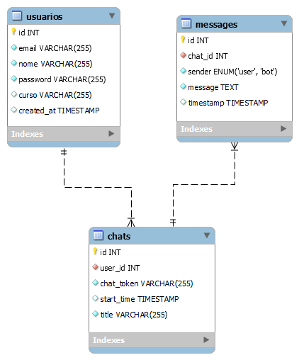

# 🔙 Chat com IA - Back-end

Este repositório contém o back-end do projeto **Chat com IA**, desenvolvido em **PHP** para gerenciar a lógica do servidor e a integração com o banco de dados **Google Cloud SQL**. 🌐  

---

## 🧠 Sobre o Projeto

O back-end é responsável por processar as solicitações do front-end, garantindo segurança, persistência de dados e uma comunicação eficiente.  
🔑 Ele inclui autenticação de usuários, armazenamento de histórico de chats e endpoints para operações como edição e exclusão de chats.  

### 🚀 Tecnologias Utilizadas

- 🐘 **PHP**: Linguagem de back-end para gerenciar a lógica do servidor.
- ☁️ **Google Cloud SQL**: Banco de dados MySQL na nuvem, escalável e confiável.
- 🔒 **Hash Password**: para guardar somente o hash da senha do usuario, tornando mais seguro.
- 🌐 **CORS**: Configurado para permitir a comunicação entre o front-end e o back-end.

---

## 📂 Estrutura do Projeto

```bash
backend/
├── api/                      # Endpoints da API
│   ├── db_connect.php        # Conectar com o banco de dados
│   ├── login.php             # Autenticação de usuários
│   ├── register.php          # Cadastro de novos usuários
│   ├── get_user_info         # Retorna as infoemações do usuário
│   ├── update_user_inf.php   # Atualiza os dados do usuário
│   ├── delete_user.php       # Deleta um usuario e todos e chats e mensagens asociadas a ele
│   ├── chat_start.php        # Cria um novo chat no banco de  dados
│   ├── send_message.php      # Salva a mensagem enviada pelo usuário
│   ├── get_chats.php         # Retorna os chats associados a um usuário
│   ├── get_messages.php      # Retorna todas a messagens asociadas a um chat é um usuario
│   ├── update_chat_title.php # Atualiza o título de um chat
│   └── delete_chat.php       # Remove chats do banco de dados
└── .env                      # Variáveis de ambiente
```

## Banco de Dados:
<p align="center">
  
</p>

## 🌟 Funcionalidades
- 🔑 Autenticação: Login e registro de usuários com validação de credenciais.
- 💬 Gerenciamento de Chats:
    - Criar, renomear e deletar chats.
    - Armazenamento seguro do histórico no banco de dados.
- 🛠️ API RESTful: Endpoints organizados e documentados.

## 🔧 Como Rodar o Projeto
- Pré-requisitos PHP (v8.0 ou superior), Servidor local (como XAMPP, WAMP ou PHP embutido), Banco de dados MySQL (Google Cloud SQL ou local) Composer

1. Clone o repositório:

```bash
git clone https://github.com/wallacemt/wydenaiAPI.git
```
2. Acesse a pasta do projeto:

```bash
cd wydenaiAPI
```

3. Instale as dependências:

```bash
composer install

```
4. Configure as variáveis de ambiente no arquivo .env:

```bash
DB_HOST=seu-host
DB_NAME=seu-banco
DB_USER=seu-usuario
DB_PASSWORD=sua-senha
```
5. Inicie o servidor:
```bash
php -S localhost:8000
```

## 📧 Contato
- Desenvolvido por minha Equipe. Entre em contato para dúvidas ou sugestões:
- 📩 wallacesantanak0@gmail.com

### 🎉 Contribuições são bem-vindas!